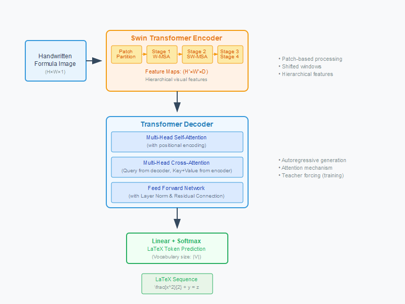
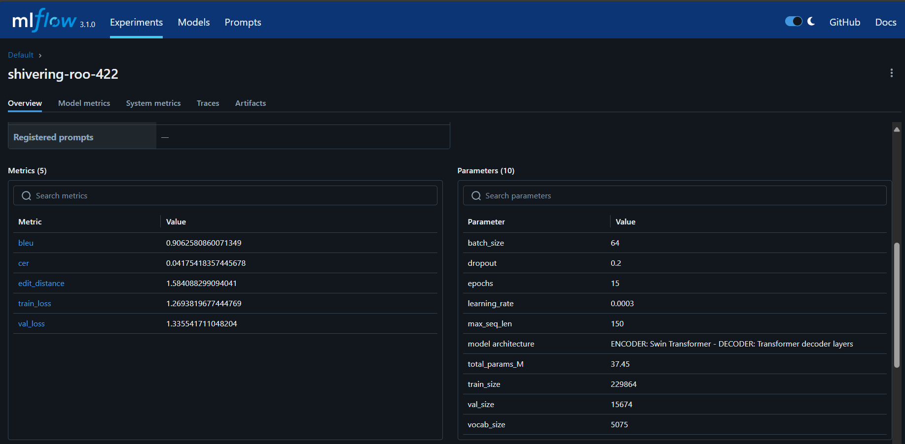
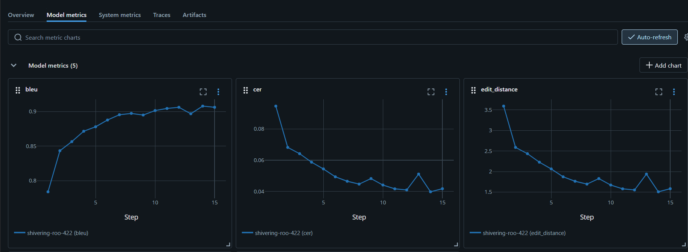
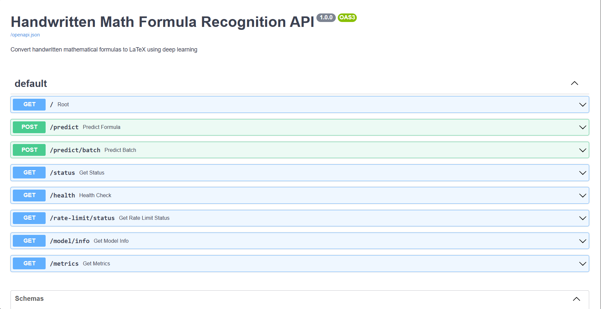

# 🧠 Handwritten Math OCR API

**A complete end-to-end solution for recognizing handwritten mathematical formulas and converting them to LaTeX code. This project demonstrates not only advanced machine learning model development but also production-ready API deployment with modern DevOps practices.**

<div align="center">
  
  
  
  
</div>

---

## 🎯 Project Overview

This project showcases a **complete machine learning pipeline** from research to production deployment:

- **🔬 Advanced Model Development**: Swin Transformer + Transformer Decoder architecture with custom training optimizations
- **🏗️ Production-Ready API**: FastAPI with authentication, rate limiting, monitoring, and health checks
- **📦 Containerized Deployment**: Docker and Docker Compose for consistent deployments
- **☁️ Cloud Infrastructure**: Deployed on Google Cloud Platform with auto-scaling capabilities
- **📊 MLOps Integration**: Optional MLflow support for experiment tracking and model versioning
- **🔒 Enterprise Features**: API key authentication, Redis-based rate limiting, comprehensive logging

This demonstrates not just ML model building skills, but also **full-stack development**, **DevOps practices**, and **production system design**.

---

## 🚀 Key Features & Technical Highlights

### 🤖 **Advanced Machine Learning**
- **Swin Transformer Encoder**: State-of-the-art vision transformer for image feature extraction
- **Custom Transformer Decoder**: Specialized architecture for sequential LaTeX generation
- **Optimized Training Pipeline**: Label smoothing, learning rate scheduling, mixed precision training
- **MLflow Integration**: Optional experiment tracking and model versioning (`train_mlflow.py`)

### 🏗️ **Production-Ready Architecture**
- **FastAPI Framework**: High-performance async API with automatic OpenAPI documentation
- **Enterprise Security**: API key authentication, request validation, CORS handling
- **Advanced Rate Limiting**: Redis-based multi-tier limiting (per minute/hour/day)
- **Comprehensive Monitoring**: Health checks, metrics collection, system monitoring
- **Batch Processing**: Optimized batch prediction endpoints for high throughput

### 📦 **DevOps & Deployment**
- **Containerization**: Docker multi-stage builds for optimized image sizes
- **Cloud Deployment**: Google Cloud Platform with load balancing and auto-scaling
- **CI/CD Ready**: Structured for automated testing and deployment pipelines
- **Production Monitoring**: Comprehensive logging, error tracking, and performance metrics

---

## 📊 Dataset & Data Processing

A significant engineering aspect of this project involves handling and transforming the [MathWriting Dataset](https://arxiv.org/pdf/2404.10690). The dataset is a comprehensive resource designed to advance research in handwritten mathematical expression recognition.

Originally published as part of a research paper, this dataset is provided in the `InkML` format, containing raw stroke data with spatial and time information. To utilize state-of-the-art vision models, a custom data pipeline was developed to render these raw strokes into rasterized PNG images. This conversion ensures broader compatibility with image-based analysis tools and establishes a standard Computer Vision training pipeline.

**Data Scale & Splits:**
- **Training Set:** ~220,000 images, offering a robust foundation for model development and feature extraction.
- **Validation Set:** ~15,000 images, crucial for hyperparameter fine-tuning and preventing overfitting.
- **Test Set:** ~7,000 images, providing a diverse and challenging array of handwritten expressions to assess the accuracy and generalizability of the recognition models.

## 📐 Model Architecture

<div align="center">
  
</div>


```
Input Image (H×W×1) → Swin Transformer Encoder → Feature Maps → Transformer Decoder → LaTeX Tokens
```

### **Technical Specifications**
- **Encoder**: Swin Transformer (Tiny) - 28M parameters, modified for single-channel input
- **Decoder**: 8-layer Transformer with multi-head attention (8 heads, 512 dimensions)
- **Training Optimizations**:
  - Learned positional encoding (`nn.Embedding`)
  - Label smoothing (α=0.1)
  - Adam optimizer with `ReduceLROnPlateau` learning rate scheduler
  - Mixed precision training (FP16)
  - Gradient clipping (max norm = 1.0)

### **Performance Metrics**
- **Accuracy**: 47.4% exact match on test set
- **CER (Character Error Rate)**: 0.0615 on test set
- **Inference Speed**: ~350ms per image on CPU, ~150ms on GPU
- **Model Size**: 143MB
- **Total Params**: 37.45M

### **MLflow Tracking**
- **General Information**
<div align="center">
  
</div>

- **Model metrics on validation data during the training process**
<div align="center">
  
</div>

---

## 🔧 API Endpoints & Documentation

<div align="center">
  
</div>

### **Endpoints Details**

| Endpoint | Method | Description | Auth Required |
|----------|--------|-------------|---------------|
| `/predict` | POST | Single image prediction | ✅ |
| `/predict/batch` | POST | Batch prediction (up to 10 images) | ✅ |
| `/status` | GET | API health and statistics | ❌ |
| `/health` | GET | Comprehensive health check | ❌ |
| `/model/info` | GET | Model architecture details | ❌ |
| `/metrics` | GET | System performance metrics | ❌ |
| `/rate-limit/status` | GET | Current rate limit status | ❌ |

### **Advanced Features**
- **Concurrent Request Handling**: Up to 10 concurrent requests per client (configurable)
- **Request Validation**: Comprehensive input validation and sanitization
- **Rate Limiting**: Redis-backed (with in-memory fallback) multi-tier rate limiting

---

## 🚀 Quick Start Guide

### **1. Local Development**

```bash
# Clone the repository
git clone https://github.com/ptd504/handwritten-math-ocr-api.git
cd handwritten-math-ocr-api

# Place your trained model (model.pth) and vocab file (vocab.json)
# inside app/trained-model/

# (Optional) Create app/.env with your configuration:
#   MODEL_API_KEY=your_secret_key
#   REDIS_URL=redis://localhost:6379
#   ENVIRONMENT=development

# Run with Docker Compose (app is served on http://localhost:8000)
docker-compose -f app/docker-compose.yml up --build
```

### **2. API Usage Examples**

#### **Single Image Prediction**
```bash
# The container's internal port is 8080; docker-compose maps it to localhost:8000
curl -X POST "http://localhost:8000/predict" \
  -H "X-API-Key: your_api_key" \
  -F "file=@formula_image.png"
```

Accepted file formats: `.jpg`, `.jpeg`, `.png`, `.bmp`, `.tiff`, `.webp` (max 10 MB).

#### **Batch Prediction**
```bash
# Send a JSON body with a list of base64-encoded image strings (max 10 images)
curl -X POST "http://localhost:8000/predict/batch" \
  -H "X-API-Key: your_api_key" \
  -H "Content-Type: application/json" \
  -d '{
    "images": ["<base64_image_1>", "<base64_image_2>"]
  }'
```

#### **Single Prediction Response Format**
```json
{
  "formula": "\\int_{0}^{\\infty} x^2 e^{-x} dx = 2",
  "confidence": 0.9821,
  "processing_time": 0.543,
  "timestamp": "2025-07-15 21:00:03"
}
```

#### **Batch Prediction Response Format**
```json
{
  "results": [
    {"index": 0, "formula": "x^2 + y^2", "confidence": 0.95, "success": true},
    {"index": 1, "formula": "", "confidence": null, "success": false, "error": "..."}
  ],
  "total_images": 2,
  "successful_predictions": 1,
  "processing_time": 1.02,
  "timestamp": "2025-07-15 21:00:05"
}
```

---

## 🏋️ Model Training Process (If you want to train your own model)

### **1. Data Preparation**
```bash
# Prepare your dataset according to the instruction at README file (data/README.md)

# Build vocabulary
python src/build_vocab.py
```

### **2. Training (with MLflow - optional)**
```bash
# Start MLflow server (In case you use MLflow during training process)
# Use the train_model function from train_mlflow.py instead of train.py (You can modify this in main.py)
mlflow ui --host 0.0.0.0 --port 5000

python src/main.py
```
**If you want to leverage Kaggle's training resources, run the `train-model-on-kaggle-tutorial.ipynb` notebook. After execution, the trained model will be available for download in the output section.**

### **3. Model Evaluation**
```bash
# Evaluate model performance (see result in src/results)
python src/test_model.py
```

---

## 🔒 Security & Rate Limiting

### **Authentication**
- **API Key**: Secure token-based authentication via the `X-API-Key` header (or `Authorization: Bearer <key>`)
- **Request Validation**: Comprehensive input sanitization (file type, file size)
- **CORS Configuration**: Configurable cross-origin resource sharing (defaults to no origins in production, localhost in development)

### **Rate Limiting**
```yaml
Default Rate Limits (configurable via environment variables):
  - Per Minute:    20 requests  (RATE_LIMIT_PER_MINUTE)
  - Per Hour:     200 requests  (RATE_LIMIT_PER_HOUR)
  - Per Day:     1000 requests  (RATE_LIMIT_PER_DAY)
  - Concurrent:    10 requests  (CONCURRENT_REQUESTS)
  - Auth Multiplier: 3x for authenticated users  (AUTH_MULTIPLIER)
  - Anonymous Daily Limit: 100  (ANON_DAILY_LIMIT)
  - Block Duration: 300 seconds on abuse  (BLOCK_DURATION)
```

Rate-limit state is stored in **Redis** when `REDIS_URL` is set; otherwise an **in-memory** fallback is used automatically.

### **Security Features**
- **Input Validation**: File type (`.jpg`, `.jpeg`, `.png`, `.bmp`, `.tiff`, `.webp`) and size restrictions (max 10 MB)
- **Error Handling**: Secure error messages without information leakage
- **Logging**: Comprehensive audit trail
- **DDoS Protection**: Built-in rate limiting, request throttling, and automatic client blocking on abuse

---

## 📁 Project Structure

```
handwritten-math-ocr-api/
├── app/                         # FastAPI application
│   ├── src/                     # Python source files
│   │   ├── main.py              # API server (routes, middleware, lifecycle)
│   │   ├── rate_limiter.py      # Rate limiting logic (Redis + in-memory)
│   │   ├── preprocess.py        # Image preprocessing (resize, normalize)
│   │   ├── im2latex.py          # Model loading & autoregressive inference
│   │   ├── model_swin.py        # Model architecture (Swin Transformer encoder)
│   │   ├── models.py            # Pydantic request/response schemas
│   │   ├── config.py            # Configuration constants
│   │   └── utils.py             # LaTeX tokenization & vocab utilities
│   ├── trained-model/           # Model artifacts (model.pth, vocab.json)
│   ├── docker-compose.yml       # Local deployment (maps host:8000 → container:8080)
│   ├── Dockerfile               # Multi-stage container build
│   ├── deploy.sh                # Script to automate GCP Cloud Run deployment
│   ├── monitoring-setup.sh      # Cloud Run monitoring alert setup
│   └── requirements.txt         # Python dependencies for the API
├── src/                         # Training pipeline
│   ├── main.py                  # Pipeline entry point (vocab → train → evaluate)
│   ├── train.py                 # Standard training script (Adam + ReduceLROnPlateau)
│   ├── train_mlflow.py          # Optional MLflow-integrated training script
│   ├── model_swin.py            # Model architecture (Encoder: Swin Transformer)
│   ├── model_res18trans.py      # Model architecture (Encoder: ResNet18 + Transformer)
│   ├── model.py                 # Model architecture (Encoder: ResNet18 only)
│   ├── data_loader.py           # Data loading utilities
│   ├── inference.py             # Batch inference / greedy decode helper
│   ├── tokenizer.py             # Tokenizer wrapper
│   ├── test_model.py            # Model evaluation (CER, BLEU, edit distance)
│   ├── build_vocab.py           # Vocabulary building from training labels
│   ├── config.py                # Training configuration
│   └── utils.py                 # Metrics, checkpoint save/load, vocab I/O
├── data/                        # Dataset management
│   ├── train_formulas/          # Training images (.png)
│   ├── validate_formulas/       # Validation images (.png)
│   ├── test_formulas/           # Test images (.png)
│   ├── train_labels.csv         # Training labels (image_filename, latex_label)
│   ├── validate_labels.csv      # Validation labels
│   ├── test_labels.csv          # Test labels
│   └── README.md                # Data preparation guide
├── checkpoints/                 # Saved model checkpoints from training
├── train-model-on-kaggle-tutorial.ipynb  # Kaggle training notebook
└── requirements.txt             # Python dependencies for training pipeline
```

---

## 🌟 Future Enhancements

### **Technical Roadmap**
- [ ] **Model Improvements**: Implement attention visualization and model explainability
- [ ] **Performance**: GPU acceleration and model quantization
- [ ] **Features**: Support for complex mathematical expressions and symbols
- [ ] **Scalability**: Kubernetes deployment and horizontal scaling
- [ ] **Monitoring**: Advanced APM integration and custom metrics

### **Business Features**
- [ ] **Multi-language**: Support for multiple mathematical notation systems
- [ ] **Integration**: REST API SDK for popular programming languages
- [ ] **Dashboard**: Web-based management interface
- [ ] **Analytics**: Usage analytics and prediction insights

---

## 🧑‍💻 About the Developer

**Phan Thanh Đăng**  
*Final-year Computer Science Student*  
*VNU-HCM University of Information Technology*

### **Technical Skills Demonstrated**
- **Machine Learning**: PyTorch, Transformers, Computer Vision
- **Backend Development**: FastAPI, Redis
- **DevOps**: Docker, GCP
- **Security**: API Authentication, Rate Limiting, Input Validation

---

## 📞 Contact & Links

- **Email**: thanhdangphan1510@gmail.com
- **GitHub**: [github.com/ptd504](https://github.com/ptd504)
- **LinkedIn**: [linkedin.com/in/ptd504](https://linkedin.com/in/ptd504)

---

## 📄 License

This project is licensed under the MIT License - see the [LICENSE](LICENSE) file for details.

---

<div align="center">
  <strong>⭐ If you find this project interesting, please consider giving it a star!</strong>
</div>

<div align="center">
  <sub>Built with ❤️ for demonstrating production-ready ML system development</sub>
</div>
