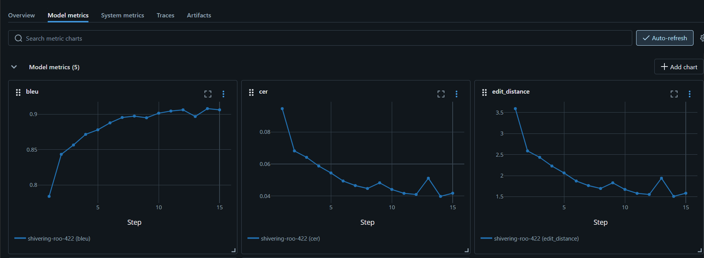

# 🧠 Handwritten Math OCR API

**A complete end-to-end solution for recognizing handwritten mathematical formulas and converting them to LaTeX code. This project demonstrates not only advanced machine learning model development but also production-ready API deployment with modern DevOps practices.**

<div align="center">
  
  
  
  
</div>

---

## 🎯 Project Overview

This project showcases a **complete machine learning pipeline** from research to production deployment:

- **🔬 Advanced Model Development**: Swin Transformer + Transformer Decoder architecture with custom training optimizations
- **🏗️ Production-Ready API**: FastAPI with authentication, rate limiting, monitoring, and health checks
- **📦 Containerized Deployment**: Docker and Docker Compose for consistent deployments
- **☁️ Cloud Infrastructure**: Deployed on Google Cloud Platform with auto-scaling capabilities
- **📊 MLOps Integration**: MLflow for experiment tracking and model versioning
- **🔒 Enterprise Features**: API key authentication, Redis-based rate limiting, comprehensive logging

This demonstrates not just ML model building skills, but also **full-stack development**, **DevOps practices**, and **production system design**.

---

## 🚀 Key Features & Technical Highlights

### 🤖 **Advanced Machine Learning**
- **Swin Transformer Encoder**: State-of-the-art vision transformer for image feature extraction
- **Custom Transformer Decoder**: Specialized architecture for sequential LaTeX generation
- **Optimized Training Pipeline**: Label smoothing, learning rate scheduling, mixed precision training
- **MLflow Integration**: Comprehensive experiment tracking and model versioning

### 🏗️ **Production-Ready Architecture**
- **FastAPI Framework**: High-performance async API with automatic OpenAPI documentation
- **Enterprise Security**: API key authentication, request validation, CORS handling
- **Advanced Rate Limiting**: Redis-based multi-tier limiting (per minute/hour/day)
- **Comprehensive Monitoring**: Health checks, metrics collection, system monitoring
- **Batch Processing**: Optimized batch prediction endpoints for high throughput

### 📦 **DevOps & Deployment**
- **Containerization**: Docker multi-stage builds for optimized image sizes
- **Cloud Deployment**: Google Cloud Platform with load balancing and auto-scaling
- **CI/CD Ready**: Structured for automated testing and deployment pipelines
- **Production Monitoring**: Comprehensive logging, error tracking, and performance metrics

---

## **Dataset**

- This project utilizes the [MathWriting Dataset](https://arxiv.org/pdf/2404.10690), which contains online handwritten mathematical expressions in the `InkML` format. The dataset is split into `train`, `valid`, `test`, `synthetic`, and `symbols` sets, with the `train` and `synthetic` portions used for model training. Each InkML file provides raw stroke data with spatial and time information, and the corresponding ground truth is given as a normalized LaTeX string in the `normalizedLabel` field.

- Since the Swin Transformer encoder requires image input, the InkML stroke data must be converted into a rasterized image format, such as `PNG`, before training. This process involves rendering the raw strokes onto a digital canvas. The dataset is licensed under the [CC BY-NC-SA 4.0 license](https://creativecommons.org/licenses/by-nc-sa/4.0/).

## 📐 Model Architecture

<div align="center">
  
</div>


```
Input Image (H×W×1) → Swin Transformer Encoder → Feature Maps → Transformer Decoder → LaTeX Tokens
```

### **Technical Specifications**
- **Encoder**: Swin Transformer (Tiny) - 28M parameters, modified for single-channel input
- **Decoder**: 8-layer Transformer with multi-head attention (8 heads, 512 dimensions)
- **Training Optimizations**:
  - Sinusoidal positional encoding
  - Label smoothing (α=0.1)
  - AdamW optimizer with cosine annealing
  - Mixed precision training (FP16)
  - Gradient clipping and accumulation

### **Performance Metrics**
- **Accuracy**: 47.4% exact match on test set
- **CER (Character Error Rate)**: 0.0615 on test set
- **Inference Speed**: ~350ms per image on CPU, ~150ms on GPU
- **Model Size**: 143MB
- **Total Params**: 37.45M

### **MLflow Tracking**
- **General Information**
<div align="center">
  
</div>

- **Model metrics on validation data during the training process**
<div align="center">
  
</div>

---

## 🔧 API Endpoints & Documentation

<div align="center">
  
</div>

### **Endpoints Details**

| Endpoint | Method | Description | Auth Required |
|----------|--------|-------------|---------------|
| `/predict` | POST | Single image prediction | ✅ |
| `/predict/batch` | POST | Batch prediction (up to 10 images) | ✅ |
| `/status` | GET | API health and statistics | ❌ |
| `/health` | GET | Comprehensive health check | ❌ |
| `/model/info` | GET | Model architecture details | ❌ |
| `/metrics` | GET | System performance metrics | ❌ |
| `/rate-limit/status` | GET | Current rate limit status | ❌ |

### **Advanced Features**
- **Concurrent Request Handling**: Up to 5 concurrent requests per client
- **Request Validation**: Comprehensive input validation and sanitization
- **Response Caching**: Redis-based caching for improved performance

---

## 🌐 Cloud Deployment (GCP)
### **Infrastructure Components**
- **Google Cloud Run**: Serverless container deployment with auto-scaling
- **Google Cloud Build**: Automated image building and pushing to Container Registry
- **Redis Memorystore**: Rate limiting and caching layer
- **Cloud Logging**: Centralized logging and monitoring
- **Cloud Monitoring**: Performance metrics and alerting

### **Deployment Features**
- **Auto-scaling**: 0-100 instances based on demand
- **Health Checks**: Kubernetes-style liveness and readiness probes
- **SSL/TLS**: Automatic certificate management

---

## 🚀 Quick Start Guide

### **1. Local Development**

```bash
# Clone the repository
git clone https://github.com/ptd504/handwritten-math-ocr-api.git
cd handwritten-math-ocr-api

# Prepare your model, vocab files
# Edit .env with your configuration

# Run with Docker Compose
docker-compose -f app/docker-compose.yml up --build
```

### **2. API Usage Examples**

#### **Single Image Prediction**
```bash
curl -X POST "http://localhost:8000/predict" \
  -H "X-API-Key: your_api_key" \
  -F "file=@formula_image.png"
```

#### **Batch Prediction**
```bash
curl -X POST "http://localhost:8000/predict/batch" \
  -H "X-API-Key: your_api_key" \
  -H "Content-Type: application/json" \
  -d '{
    "images": ["base64_image_1", "base64_image_2"]
  }'
```

#### **Response Format**
```json
{
  "formula": "\\int_{0}^{\\infty} x^2 e^{-x} dx = 2",
  "confidence": 0.9821,
  "processing_time": 0.543,
  "timestamp": "2025-07-15 21:00:03"
}
```

---

## 🏋️ Model Training Process (If you want to train your own model)

### **1. Data Preparation**
```bash
# Prepare your dataset according to the instruction at README file (data/README.md)

# Build vocabulary
python src/build_vocab.py
```

### **2. Training (with MLflow - optional)**
```bash
# Start MLflow server (In case you use MLflow during training process)
# Use the train_model function from train_mlflow.py instead of train.py (You can modify this in main.py)
mlflow ui --host 0.0.0.0 --port 5000

python src/main.py
```
**If you want to leverage Kaggle's training resources, run the `train-model-on-kaggle-tutorial.ipynb` notebook. After execution, the trained model will be available for download in the output section.**

### **3. Model Evaluation**
```bash
# Evaluate model performance (see result in src/results)
python src/test_model.py
```

## 🔒 Security & Rate Limiting

### **Authentication**
- **API Key**: Secure token-based authentication
- **Request Validation**: Comprehensive input sanitization
- **CORS Configuration**: Secure cross-origin resource sharing

### **Rate Limiting**
```yaml
Rate Limits:
  - Per Minute: 10 requests
  - Per Hour: 100 requests  
  - Per Day: 500 requests
  - Concurrent: 5 requests
  - Auth Multiplier: 2x for authenticated users
```

### **Security Features**
- **Input Validation**: File type and size restrictions
- **Error Handling**: Secure error messages without information leakage
- **Logging**: Comprehensive audit trail
- **DDoS Protection**: Built-in rate limiting and request throttling

---

## 📁 Project Structure

```
handwritten-math-ocr-api/
├── app/                         # FastAPI application
│   ├── main.py                  # API server implementation
│   ├── rate_limiter.py          # Rate limiting logic
│   ├── preprocess.py            # Image preprocessing
│   ├── im2latex.py              # Model inference
│   ├── config.py                # Configuration management
│   ├── docker-compose.yml       # Local deployment
│   └── trained-model/           # Model artifacts
│   └── Dockerfile               # Container configuration
│   └── deploy.sh                # Script to automate model deployment
│   └── monitoring-setup.sh      # Cloud Run monitoring alert setup
│   └── requirements.txt         # For FastAPI application and GCP (Deployment)
├── src/                         # Training pipeline
│   ├── train.py                 # Standard training script
│   ├── train_mlflow.py          # MLflow integrated training
│   ├── model_swin.py            # Model architecture (Encoder: Swin Transformer)
│   ├── model_res18trans.py      # Model architecture (Encoder: ResNet18 + Transformer Encoder)
│   ├── model.py                 # Model architecture (Encoder: ResNet18)
│   ├── dataset.py               # Data loading utilities
│   ├── test_model.py            # Model evaluation
│   └── build_vocab.py           # Vocabulary building
│   └── main.py                  # Pipeline for training (from build vocab to train model)
├── data/                        # Dataset management
│   ├── train_formulas/          # Train data
│   ├── validate_formulas/       # Validate data
│   ├── test_formulas/           # Test data
│   ├── labels                   # (.csv) Label files, including (train, validate and test)
│   └── README.md                # Data preparation guide
├── checkpoints/                 # Model checkpoints
└── requirements.txt             # Python dependencies
```

---

## 🌟 Future Enhancements

### **Technical Roadmap**
- [ ] **Model Improvements**: Implement attention visualization and model explainability
- [ ] **Performance**: GPU acceleration and model quantization
- [ ] **Features**: Support for complex mathematical expressions and symbols
- [ ] **Scalability**: Kubernetes deployment and horizontal scaling
- [ ] **Monitoring**: Advanced APM integration and custom metrics

### **Business Features**
- [ ] **Multi-language**: Support for multiple mathematical notation systems
- [ ] **Integration**: REST API SDK for popular programming languages
- [ ] **Dashboard**: Web-based management interface
- [ ] **Analytics**: Usage analytics and prediction insights

---

## 🧑‍💻 About the Developer

**Phan Thanh Đăng**  
*Final-year Computer Science Student*  
*VNU-HCM University of Information Technology*

### **Technical Skills Demonstrated**
- **Machine Learning**: PyTorch, Transformers, Computer Vision
- **Backend Development**: FastAPI, Redis
- **DevOps**: Docker, GCP
- **Security**: API Authentication, Rate Limiting, Input Validation

---

## 📞 Contact & Links

- **Email**: thanhdangphan1510@gmail.com
- **GitHub**: [github.com/ptd504](https://github.com/ptd504)
- **LinkedIn**: [linkedin.com/in/ptd504](https://linkedin.com/in/ptd504)

---

## 📄 License

This project is licensed under the MIT License - see the [LICENSE](LICENSE) file for details.

---

<div align="center">
  <strong>⭐ If you find this project interesting, please consider giving it a star!</strong>
</div>

<div align="center">
  <sub>Built with ❤️ for demonstrating production-ready ML system development</sub>
</div>